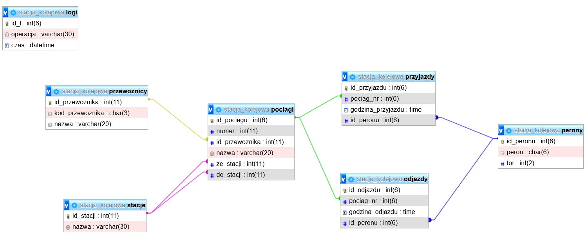

# Train Station DataBase
SQL project for the credit of a course "Databases", exported from phpMyAdmin server.
The task was to create a relational database. I've chosen to use real data that shows trains departures and arrivals on Katowice Station on a given day. 

Relations diagram:

